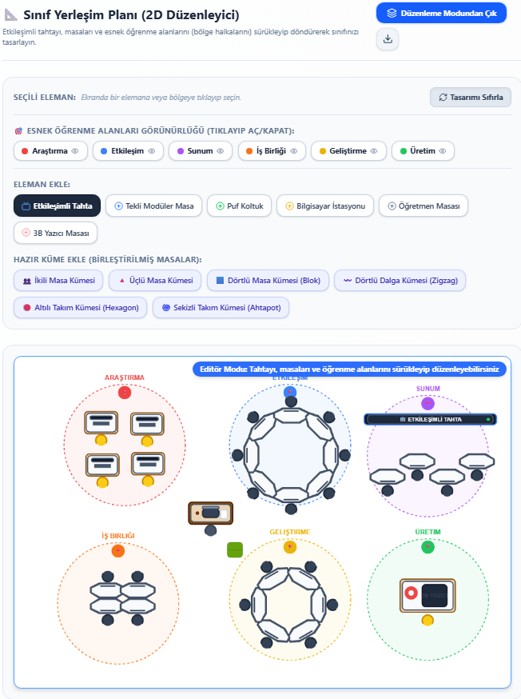
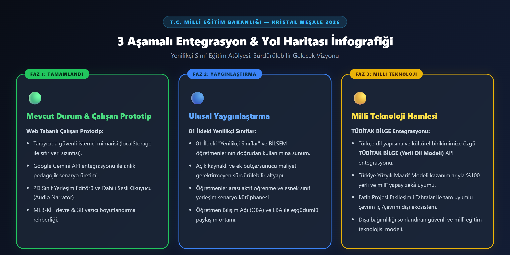

# 💡 Yenilikçi Sınıf Eğitim Atölyesi

> **Yapay Zeka Destekli Aktif Öğrenme Planlayıcısı**
>
> Öğretmenlerimizin derslerinde aktif öğrenme tekniklerini, **Türkiye Yüzyılı Maarif Modeli** müfredat standartlarını ve **Esnek Öğrenme Alanları** pedagojilerini saniyeler içinde planlayabilmesi için geliştirilmiş modern, yapay zeka destekli bir web uygulamasıdır.

---

## 🌐 Uygulamaya Ulaşın ve Hemen Kullanın

Uygulamayı herhangi bir kurulum yapmadan doğrudan tarayıcınız üzerinden ücretsiz kullanabilirsiniz:
👉 **[Yenilikçi Sınıf Eğitim Atölyesi Planlayıcısı'nı Aç](https://hsanylmaz.github.io/YS_Etkinlik)**

---

## 🚀 Başlamadan Önce Yapılması Gereken Ayarlar

Sistemi kullanabilmeniz için tarayıcınız üzerinden yapmanız gereken tek bir temel ayar bulunmaktadır:

### 1. Gemini API Anahtarı Tanımlama (Zorunlu)
Uygulamanın yapay zeka özelliklerini kullanabilmesi için bir Google Gemini API anahtarına ihtiyacı vardır. Bu anahtarı almak tamamen ücretsizdir:
1. [Google AI Studio](https://aistudio.google.com/) adresine gidin ve Google hesabınızla giriş yapın.
2. **"Create API Key"** butonuna tıklayarak ücretsiz bir API anahtarı oluşturun ve kopyalayın.
3. Uygulamanın sağ üst köşesindeki **"API Ayarları"** (vites simgeli) butonuna tıklayın.
4. Kopyaladığınız anahtarı kutucuğa yapıştırıp **"Kaydet"** butonuna basın.

📺 **Video Rehber:** [Gemini API Anahtarı Nasıl Alınır? (YouTube)](https://www.youtube.com/watch?v=9XI-bJYSotk)

> **Not:** API anahtarınız kesinlikle hiçbir sunucuya veya dış servise gönderilmez; yalnızca sizin tarayıcınızın yerel hafızasında (`localStorage`) güvenli bir şekilde saklanır.

---

## 🌟 Proje Vizyonu ve Teknolojik Entegrasyonlar

### 🎙️ Kapsayıcı ve Etkileşimli Sesli Plan Dinleme Özelliği
Platformumuz, **Türkiye Yüzyılı Maarif Modeli**’nin kapsayıcı eğitim vizyonuna uygun olarak görme engelli veya öğrenme güçlüğü yaşayan öğretmenlerin içeriklere engelsiz erişimini sağlayan **Sesli Dinleme Modülü** ile donatılmıştır. Üretilen ders planı; *Genel Bilgiler, Kazanımlar, Hazırlık, Uygulama ve Değerlendirme* başlıklarına akıllıca ayrıştırılarak gerçekçi Türkçe ses sentezleyicisi ile seslendirilir. Öğretmenler planın tamamını dinleyebileceği gibi doğrudan istediği bölüme tıklayarak atlayabilir, okuma hızını ayarlayabilir ve cümle cümle ilerletebilir. Bu özellik, öğretmenlerin materyal hazırlığı esnasında çoklu görev yürüterek zamandan tasarruf etmesini ve derse odaklanmasını sağlar.

### 🚀 Gelecekteki BİLGE ve Millî Teknoloji Hamlesi Entegrasyonu
Projemiz, Türkiye'nin dijital eğitim vizyonunu yansıtan TÜBİTAK BİLGE platformu ve "Millî Teknoloji Hamlesi" hedefleriyle tam bir entegrasyon ve sinerji oluşturacak şekilde kurgulanmıştır. Şuanlık gemini API kullanımı yapılsa da ilerleyen günlerde türkçenin kendine özgü yapısını ve kültürel birikimimizi temel alan büyük dil modeli olan TÜBİTAK BİLGE API'sı kullanılacaktır. Öğrencilerin sadece teknolojiyi tüketen değil; aktif öğrenme, tasarım odaklı düşünme ve problem çözme becerileriyle yerli ve millî teknolojik çözümler üreten üretken nesiller olarak yetiştirilmesini amaçlar.

### 🎒 MEB-KİT Uyumluluğu ve Robotik Kodlama Entegrasyonu
Uygulama, MEB-KİT Robotik Kodlama Seti ve MEB-KİT Kodlama Platformu ile tam uyumludur. Planlama sırasında MEB-KİT entegrasyonu seçildiğinde:
* Kazanımlara tam uyumlu robotik devre bağlantıları ve sensör şemaları otomatik olarak önerilir.
* Sınıf seviyesine göre (Ortaokul için blok tabanlı ASCII diyagramları, Lise için C++ kod yapıları) hazır kod blokları ve uygulama yönergeleri plana dahil edilir.

### 🖨️ 3B Yazıcı Arama Kısayolu ve Hızlı Erişim
Ders planında 3B yazıcı kullanımı etkinleştirildiğinde, sistem kazanımın konusunu otomatik olarak analiz ederek İngilizce anahtar kelimelere dönüştürür:
* **Thingiverse, Printables, Tinkercad ve Creality Cloud** gibi dünyanın en popüler 3B model kütüphaneleri için tek tıkla arama yapabileceğiniz özel arama kısayolları üretir.
* Tasarımların okul laboratuvarlarındaki **Creality K1C** gibi modern yazıcıların maksimum baskı hacmi sınırları (220x220x250 mm) içerisinde kalacak şekilde boyutlandırılması için rehberlik sağlar.

### 🏷️ Standart ve Kurumsal Etkinlik ID Sistemi
Platformumuzda üretilen tüm ders planları, MEB Maarif Modeli kazanım kodları ve kullanılan teknolojik araçlarla otomatik olarak eşleşen standart bir **Etkinlik ID** kodu ile etiketlenir:

* **Format Yapısı:** `ETK-[KAZANIM_KODU][TEKNOLOJİ_ROZETİ]`
  * **Önek:** Her zaman `ETK`
  * **Kazanım Kodu:** `[DERS].[SINIF].[ÜNİTE].[KAZANIM]` (Örn: `İTA.8.2.1`, `MAT.5.1.2`, `FEN.6.3.1`, `SB.7.6.1`)
  * **Teknoloji Rozeti (Varsa):** MEB-KİT için `-KIT`, 3B Yazıcı için `-3B`, ikisi birlikte ise `-KIT-3B`

#### 📋 Örnek İsimlendirme Tablosu:
| Seçilen Ders, Sınıf, Kazanım ve Araçlar | Oluşan Standart Etkinlik ID |
|---|---|
| 8. Sınıf T.C. İnkılap Tarihi (`İTA.8.2.1`) | **`ETK-İTA.8.2.1`** |
| 5. Sınıf Matematik (`MAT.5.1.2`) + **MEB-KİT** | **`ETK-MAT.5.1.2-KIT`** |
| 6. Sınıf Fen Bilimleri (`FEN.6.3.1`) + **3B Yazıcı** | **`ETK-FEN.6.3.1-3B`** |
| 5. Sınıf Bilişim Teknolojileri (`BİL.5.2.1`) + **MEB-KİT & 3B** | **`ETK-BİL.5.2.1-KIT-3B`** |
| 7. Sınıf Sosyal Bilgiler (`SB.7.6.1`) | **`ETK-SB.7.6.1`** |
| 9. Sınıf Kimya (`KİM.9.1.2`) | **`ETK-KİM.9.1.2`** |

---

## 🎨 2D Sınıf Yerleşim Editörü

Uygulamada yer alan interaktif **2D Sınıf Yerleşim Planı** modülü sayesinde:
* Sınıfınızdaki öğrenci sıralarını, öğretmen kürsüsünü, akıllı tahtayı ve diğer fiziksel elemanları sürükle-bırak yöntemiyle serbestçe konumlandırabilirsiniz.
* Aktif öğrenme senaryonuza en uygun fiziksel yerleşim düzenini (U-Düzen, Küme Düzeni, Grup Çalışması vb.) görsel olarak tasarlayabilirsiniz.
* Tasarladığınız bu yerleşim planı, Word belgesi çıktısı aldığınızda otomatik olarak planınızın ekler bölümündeki tabloya görsel olarak entegre edilir.

### 📸 Örnek 2D Sınıf Yerleşim Tasarımı:

---

## 📂 Google Drive Özellikleri
Uygulamadaki **"Drive'a Kaydet"** ve **"Drive Klasörü"** özellikleri önceden yapılandırılmıştır. 
* Hazırladığınız senaryoları doğrudan ortak Google Drive klasörümüze tek tıkla kaydedebilirsiniz.
* Güvenlik protokolü gereği, sistem sadece **kendi yüklediğiniz dosyaları silmenize** izin verir; diğer öğretmenlerin yüklediği belgelere erişim veya silme yetkiniz bulunmaz.

> **Not:** Eğer "Drive'a Kaydet" seçeneğiyle yükleme yaparken **"Failed to fetch"** hatası alıyorsanız, bu durum tarayıcınızdaki reklam engelleyici eklentilerden (uBlock Origin, AdBlock vb.) veya tarayıcı güvenlik korumalarından (Brave Shields vb.) kaynaklanabilir. Lütfen bu eklentileri bu site için geçici olarak devre dışı bırakıp veya siteyi **Gizli Sekmede** açarak yeniden deneyin.

---

## 🗺️ 3 Aşamalı Entegrasyon & Yol Haritası (Gelecek Vizyonu)

Yenilikçi Sınıf Eğitim Atölyesi'nin sürdürülebilir, yerli ve millî eğitim teknolojileri vizyonunu özetleyen 3 aşamalı entegrasyon yol haritası infografiği:

